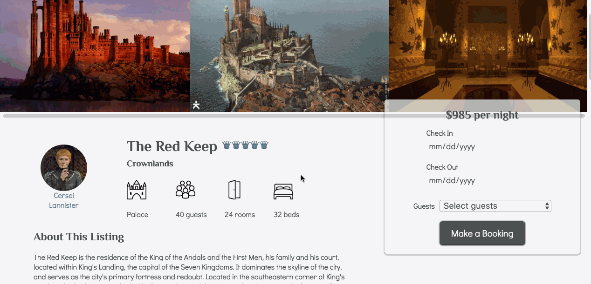
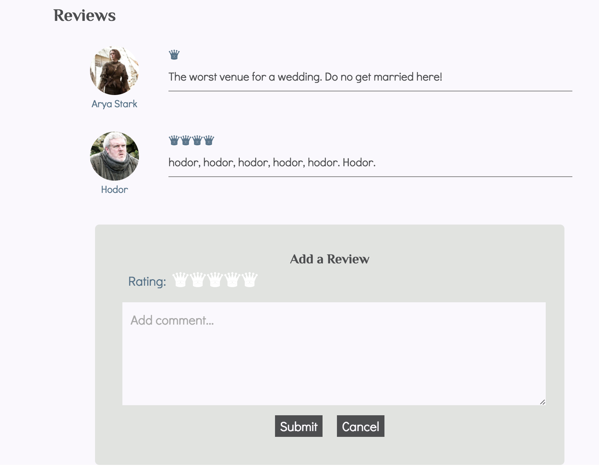
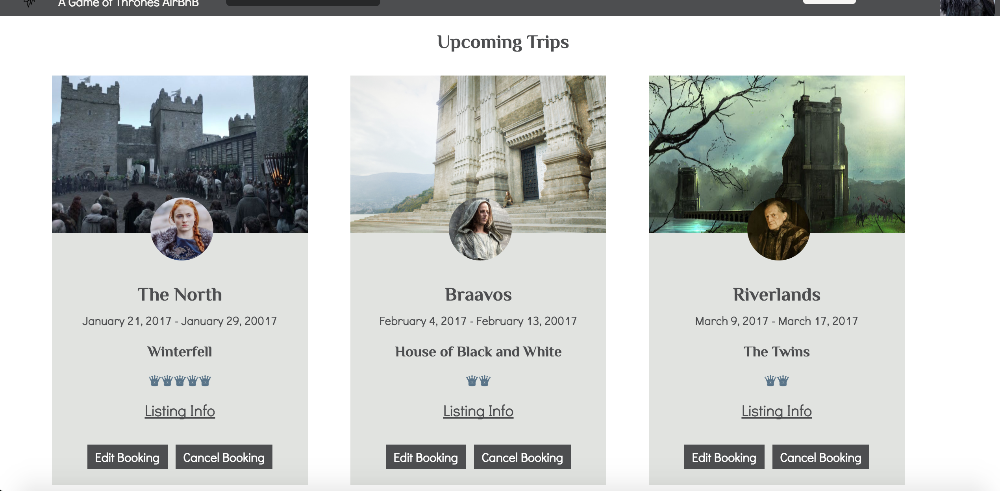

# AirGoT
[AirGoT Live](https://air-got.herokuapp.com)

AirGoT is a full-stack web application inspired by AirBnB and popular TV series Game of Thrones. It utilizes Ruby on Rails on the backend, a PostgreSQL database, and React.js with a Redux architectural framework on the frontend.

## Features & Implementation

### Search by Location with Map

Upon entering the splash page, the regions are fetched by an API call made to the database. Their images and names are rendered at the bottom of the page and are filterable in the search bar. By clicking on one of the search bar options or region images, a search pane will be rendered. The search pane includes a custom Google map initially zoomed to your chosen region, along with the places within the bounds of the map. The places index will adjust accordingly as the map is dragged or zoomed in or out to change the view.

### Places and Reviews

By clicking on one of the marked locations on the map or the image in the places index, the place details will be rendered. The place show page includes scrollable images, the title, price, description, maximum number of guests, house rules, property type, etc. All of the reviews for the place lie beneath its details. Each review has an image and name of the author, a rating, and a body. Below the reviews index is a form to add a review of your own if you are logged in. There is also a button to delete a particular review it its author is the current user.

This page also has a form to create a booking for the current place with input fields for the dates and number of guests.

### Bookings

Once logged in, the Trips button will render the bookings index. On entering this component, an API request will be made to the database to fetch all of the bookings for the current user. Each booking item will show an image of the place, an image of the host, the region name, place title, booking dates, a link back to the place show component, and buttons to edit or cancel a booking.

